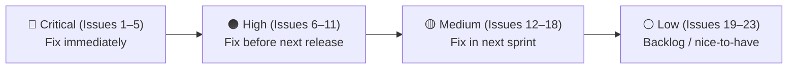

# Design Review Results: ProBio — Landing Page (/) & Dashboard (/dashboard)

**Review Date**: 2026-03-07  
**Routes Reviewed**: `/` (Landing Page) · `/dashboard` (Profile Builder)  
**Focus Areas**: Visual Design · UX/Usability · Responsive/Mobile · Consistency  

> **Note**: This review was conducted through static code analysis only. Visual inspection via browser would provide additional insights into layout rendering, interactive behaviors, and actual appearance.

---

## Summary

ProBio has a strong, cohesive visual identity (zinc dark theme, amber accent, Oswald/Inter pairing) and a well-structured component hierarchy. The main concerns are: several accessibility violations that would block screen-reader users, misleading hardcoded content on the public profile page, a broken quote form, and a missing tablet-breakpoint experience in the dashboard. Fixing the critical and high-priority items would substantially improve usability, trust, and WCAG compliance.

---

## Issues

| # | Issue | Criticality | Category | Location |
|---|-------|-------------|----------|----------|
| 1 | **Quote form is a no-op stub**: The `<form>` in the public profile page has a server action that does nothing (`/* Edge function integration here later */`). Submitting the form gives no feedback — the user believes their quote was sent when it was not. | 🔴 Critical | UX/Usability | `src/app/[slug]/page.tsx:120` |
| 2 | **Hardcoded trust badges are misleading**: "A+ BBB Rating" and "OSHA Certified" badges appear on every profile regardless of actual certifications. These are trust signals that could be legally problematic and erode user trust if inaccurate. | 🔴 Critical | UX/Usability | `src/app/[slug]/page.tsx:77–88`, `src/components/MobilePreview.tsx:56–67` |
| 3 | **Hardcoded "Recent job" stamp**: `"Recent job completed in Arlington • 2h ago"` is hardcoded placeholder text that appears on every live public profile — misleading customers into thinking it's real job activity data. | 🔴 Critical | UX/Usability | `src/app/[slug]/page.tsx:65`, `src/components/MobilePreview.tsx:44` |
| 4 | **Form labels not programmatically linked to inputs**: `BuilderForm`, `OnboardingForm`, and the quote form in `[slug]/page.tsx` all have `<label>` elements placed adjacent to inputs without `htmlFor`/`id` pairs. Screen readers cannot associate the label with the input, violating WCAG 2.1 SC 1.3.1 (Info and Relationships). | 🔴 Critical | Accessibility | `src/components/BuilderForm.tsx:29,39,45,58,67`, `src/components/OnboardingForm.tsx:50–88`, `src/app/[slug]/page.tsx:148–151` |
| 5 | **`focus:outline-none` with no accessible replacement**: All form inputs use `focus:outline-none` and replace it only with a border color change (`focus:border-brand-amber`). A 1px border colour change does not meet WCAG 2.1 SC 2.4.7 (Focus Visible) or the stricter SC 2.4.11 in WCAG 2.2 which requires a visible focus indicator with sufficient contrast and area. | 🔴 Critical | Accessibility | `src/components/BuilderForm.tsx:31,41,49,59,69`, `src/components/OnboardingForm.tsx:52,67,83` |
| 6 | **`BeforeAfterSlider` is static but presented as interactive**: The component has a `cursor-ew-resize` cursor and a drag-instruction label ("Drag to compare Before & After") but has no drag/pointer logic implemented. End users on the live public profile page will grab and release the slider with no result. | 🟠 High | UX/Usability | `src/components/BeforeAfterSlider.tsx:10` |
| 7 | **No active navigation state**: Neither the desktop sidebar nor the mobile top nav highlight the current page. Both `Builder` and `Settings` links render with identical styling regardless of the active route. Missing `aria-current="page"` also prevents screen readers from identifying the active page. | 🟠 High | UX/Usability · Accessibility | `src/app/dashboard/layout.tsx:42–49, 73–74` |
| 8 | **MobilePreview hidden at `md` breakpoint**: The live preview panel uses `hidden lg:flex`, meaning users on tablets (768–1023px) get the editor form only with no way to see how their profile looks. The whole value proposition of "what you see is what you get" is broken for ~30% of screen sizes. | 🟠 High | Responsive/Mobile | `src/components/DashboardClient.tsx:59` |
| 9 | **Decorative Lucide icons missing `aria-hidden="true"`**: Feature-card icons (`<Zap>`, `<ShieldCheck>`, `<Wrench>`, etc.) used purely as decorative elements are not hidden from assistive technologies. Screen readers will announce them as unlabelled graphics. | 🟠 High | Accessibility | `src/app/page.tsx:10,48,55,62`, `src/app/[slug]/page.tsx:3–5` (all usage sites) |
| 10 | **Animations do not respect `prefers-reduced-motion`**: `animate-ping`, `animate-pulse`, and `hover:scale-105` / `hover:scale-[1.02]` run unconditionally. Users with vestibular disorders or motion sensitivity have no way to opt out, violating WCAG 2.1 SC 2.3.3 (Animation from Interactions) at AAA and best-practice guidelines. | 🟠 High | Accessibility | `src/app/page.tsx:62–64`, `src/app/[slug]/page.tsx:32–35,156–158,172,176` |
| 11 | **"View Live Profile" link opens new tab without indication**: The link has `target="_blank"` but no external-link icon or `(opens in new tab)` text, violating WCAG 2.1 SC 3.2.2 and the principle of least surprise. Also missing `rel="noopener noreferrer"` which is a security concern. | 🟠 High | Accessibility · UX/Usability | `src/app/dashboard/page.tsx:25–30` |
| 12 | **Save feedback is an inline text near "Editor" heading**: The success/error message appears as a small `` next to the "Editor" label. It is easy to miss, has no animation drawing attention to it, and uses `text-brand-amber` which doesn't semantically distinguish success from error. | 🟡 Medium | UX/Usability | `src/components/DashboardClient.tsx:42–43` |
| 13 | **Mobile dashboard nav lacks active state and is sparse**: The mobile top nav (`md:hidden`) shows only "Builder" and "Settings" as plain text links with no current-page indicator, no icons, and no visual hierarchy — difficult for touch users to parse quickly. | 🟡 Medium | Responsive/Mobile | `src/app/dashboard/layout.tsx:64–77` |
| 14 | **No profile completeness indicator**: Users who skip optional fields (bio, license, photo) don't know what's missing. No guidance is shown to encourage completing the profile, which likely results in weaker public profiles and lower conversion for the business. | 🟡 Medium | UX/Usability | `src/app/dashboard/page.tsx`, `src/components/DashboardClient.tsx` |
| 15 | **Landing page has no social proof**: The page goes directly from hero copy to three feature cards with no testimonials, customer count, or "used by" logos. For a product targeting trades who are skeptical of online tools ("Hate Websites"), social proof is crucial to conversion. | 🟡 Medium | UX/Usability · Visual Design | `src/app/page.tsx:21–78` |
| 16 | **Typography below 10px**: Multiple instances of `text-[8px]` (trust badge labels in MobilePreview) and `text-[10px]` (quote form labels in `[slug]/page.tsx`) fall below the WCAG-recommended 14px (or 18px bold) minimum. On small mobile screens this becomes nearly unreadable. | 🟡 Medium | Visual Design · Accessibility | `src/components/MobilePreview.tsx:54,62,66`, `src/app/[slug]/page.tsx:124,147` |
| 17 | **`animate-pulse` on CTA button is distracting and semantically incorrect**: The "Get My Quote" submit button has `animate-pulse` on a white overlay (`bg-white/20`) which makes the button appear to flicker constantly. This is visually noisy and does not communicate a loading or attention state — it just feels broken. | 🟡 Medium | Visual Design · UX/Usability | `src/app/[slug]/page.tsx:156–158` |
| 18 | **Third feature card uses `text-red-500` while first two use `text-brand-amber`**: The Emergency Pulse feature card uses `text-red-500` for its icon/container which is intentional thematically, but the amber icon container border `border-zinc-700` is inconsistent with the amber-bordered cards for the other two features. Minor visual inconsistency breaks the uniform look. | 🟡 Medium | Consistency | `src/app/page.tsx:61–68` |
| 19 | **`Trash2` delete button in BuilderForm has `title` but no `aria-label`**: The delete link button uses `title="Remove link"` which works on desktop with mouse hover, but `title` is not reliably announced by screen readers. `aria-label="Remove link"` should be added. | ⚪ Low | Accessibility | `src/components/BuilderForm.tsx:102–107` |
| 20 | **No skip-to-content link on any page**: Users who rely on keyboard navigation must tab through the full header/sidebar on every page load before reaching main content. A visually-hidden skip link is a quick win for accessibility and WCAG 2.1 SC 2.4.1. | ⚪ Low | Accessibility | `src/app/layout.tsx` (global, add here) |
| 21 | **TypeScript `any` types throughout**: `profile: any`, `link: any`, `u: any` are used across DashboardClient, BuilderForm, MobilePreview, and `[slug]/page.tsx`. The database types file at `src/lib/database.types.ts` exists — its types should be used to enable proper type checking and catch data-shape bugs. | ⚪ Low | Consistency | `src/components/BuilderForm.tsx:5`, `src/components/DashboardClient.tsx:9`, `src/components/MobilePreview.tsx:6`, `src/app/[slug]/page.tsx:107` |
| 22 | **Footer year not in a `<time>` element**: `{new Date().getFullYear()}` renders a year but without a semantic `<time>` element, it is not machine-readable. Minor semantic issue. | ⚪ Low | Consistency | `src/app/page.tsx:76` |
| 23 | **No Open Graph / social meta tags**: Only a basic `title` and `description` exist in metadata. Sharing a ProBio link on WhatsApp or LinkedIn will show no image or structured preview — missed marketing opportunity for viral spread via tradespeople sharing their profiles. | ⚪ Low | UX/Usability | `src/app/layout.tsx:21–24`, `src/app/[slug]/page.tsx` (per-profile OG) |

---

## Criticality Legend

| Level | Meaning |
|-------|---------|
| 🔴 **Critical** | Breaks functionality, actively misleads users, or violates WCAG accessibility standards |
| 🟠 **High** | Significantly impacts user experience, accessibility, or design quality |
| 🟡 **Medium** | Noticeable issue that should be addressed in the near term |
| ⚪ **Low** | Nice-to-have improvement or minor semantic/code quality concern |

---

## Next Steps (Suggested Prioritization)

**Sprint 1 — Critical fixes (can be done in 1–2 days):**
1. Disable / replace the quote form stub with a clear "Coming Soon" message or mailto link (Issue 1)
2. Remove or data-drive the BBB/OSHA badges and "Recent job" stamp (Issues 2, 3)
3. Add `htmlFor`/`id` to all form labels (Issue 4) — mechanical, low-risk
4. Replace `focus:outline-none` with `focus:ring-2 focus:ring-brand-amber focus:ring-offset-2 focus:ring-offset-zinc-950` (Issue 5)

**Sprint 2 — High-impact UX/A11y (2–3 days):**
5. Implement `BeforeAfterSlider` drag interaction or replace with a static gallery (Issue 6)
6. Add active nav state with `usePathname()` + `aria-current="page"` (Issue 7)
7. Add Editor ↔ Preview tab switcher for `md` screens (Issue 8)
8. Add `aria-hidden="true"` to all decorative icons (Issue 9)
9. Wrap animations in `@media (prefers-reduced-motion: no-preference)` (Issue 10)
10. Add `rel="noopener noreferrer"` + ExternalLink icon to "View Live Profile" (Issue 11)

**Sprint 3 — Medium polish (1 sprint):**
11. Replace inline save message with a toast notification component (Issue 12)
12. Add profile completion progress bar in the dashboard (Issue 14)
13. Add a social proof section on the landing page (Issue 15)
14. Audit and replace sub-10px font sizes (Issue 16)
15. Remove `animate-pulse` from the submit button (Issue 17)
